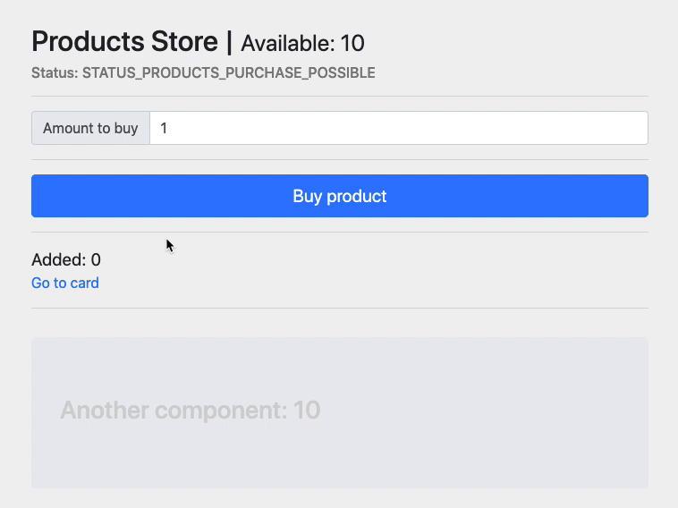

This project was bootstrapped with [Create React App](https://github.com/facebook/create-react-app).

## TASKS
1. Implement redux and propagate data to all places where ? mark, inform user with status about app state
2. Introduce async actions and add product to the card only after it's completed:
`setTimeout(()=>{}, 1000)` in trunk async action (see branch: demo-results)
3. Extract buy amount into separate component and update code to use it in buy product action (see branch: demo-results-items-to-buy)
### `npm run start`

